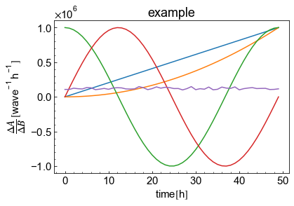

# 論文用のmatplotlib.pyplot

## 意図

- 論文用に図を作る際、毎回フォーマットを考えずに作業したい。
- with文を使うことで、matplotlibがメモリを管理する。
  - 放っておくとpythonのガベージコレクタは仕事してくれず、メモリを食い過ぎてしまう。


## 使い方
### 自作ライブラリの読み込み


```python
import sys
sys.path.append('..') #srcがあるdirにpathを通す
from src.my_plt import Subplot  # Noqa
```

### 描画


```python
xlabel="time$[\\mathdefault{h}]$"
ylabel="$\\dfrac{\\Delta A}{\\Delta B}\\,[\\mathdefault{wave^{-1}\\,h^{-1}}]$"
title="example"
with Subplot(xlabel=xlabel,ylabel=ylabel,title=title,show_results=True)as p:
    for i, coln in enumerate(df.columns):
        p.ax.plot(df.index, df[coln] * 1e6, label=coln)
    p.fig.savefig("Path to save images")
```


​    

